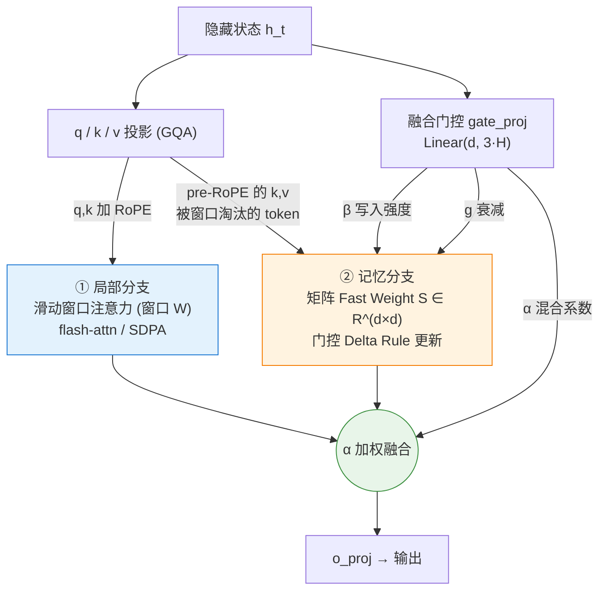
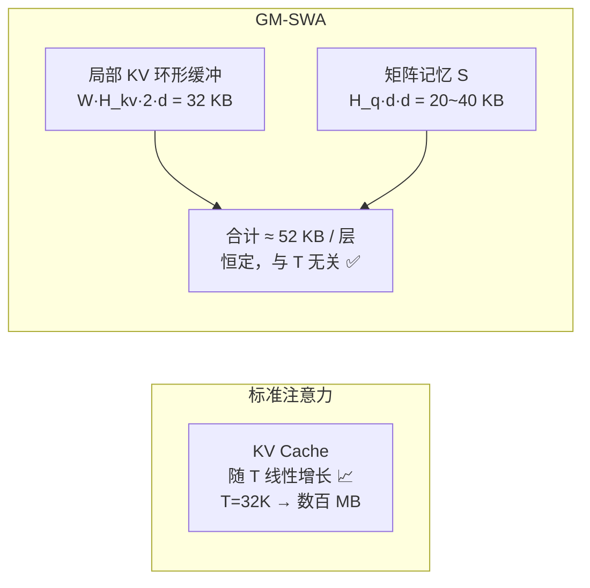

# GM-SWA 项目进展报告

> **一句话概述：** GM-SWA 是一种"滑动窗口注意力 + 矩阵记忆"的混合序列建模层 —— 用固定大小的局部窗口处理近距离依赖，用一个**常数大小、与序列长度无关**的矩阵记忆（Fast Weight）捕捉超出窗口的长程信息，从而在保持线性推理成本的同时，获得接近全注意力的长程能力。
>
> **当前状态（2026-06-01）：** v2 架构已完整实现并通过全部 13 项单元测试；340M / 1B 两个规模的训练配置就绪、参数量对齐预期；下一步进入正式预训练与基线对比评测阶段。

---

## 1. 背景与目标

标准 Transformer 的注意力开销随序列长度呈 **O(T²)**，且推理时 KV Cache 随长度线性膨胀，长上下文场景下显存和延迟都难以承受。业界两类主流缓解路线各有短板：

| 路线 | 代表 | 优点 | 短板 |
|------|------|------|------|
| 滑动窗口注意力 (SWA) | Mistral / Longformer | 成本恒定、实现简单 | 窗口外信息**彻底丢失** |
| 线性注意力 / 状态空间 | Mamba / GLA / DeltaNet | KV 恒定、长程可达 | 局部精确检索能力弱 |

**GM-SWA 的目标**：把两者的长处合并到一个层里 —— 让**局部窗口**负责"看得清近处"，让**矩阵记忆**负责"记得住远处"，再用一个可学习的门控逐头、逐位置地决定二者的混合比例。最终得到一个**推理成本与序列长度无关**、又不牺牲长程能力的注意力层。

---

## 2. 核心架构

每一层由两条并行分支组成，输出通过一个 sigmoid 门控 `α` 融合：

$$o_t = \alpha_t \cdot o_{\text{local}}[t] + (1-\alpha_t)\cdot o_{\text{mem}}[t]$$



### ① 局部分支 —— 滑动窗口注意力

标准因果滑动窗口注意力，每个位置 `t` 只看最近的 `W` 个 token：

$$o_{\text{local}}[t] = \mathrm{softmax}\!\left(q_t K_{[t-W+1:t]}^\top / \sqrt{d}\right) V_{[t-W+1:t]}$$

实现上优先调用 `flash_attn_func(causal=True, window_size=(W-1,0))`；环境无 flash-attn（如 fp32）时自动回退到等价的 SDPA + 加性掩码实现。

### ② 记忆分支 —— 矩阵 Fast Weight

每个 query head 维护一个矩阵状态 `S ∈ R^{d×d}`。**当一个 token 被滑出窗口（被"淘汰"）时**，它的 `(k, v)` 才写入记忆，用 **门控 Delta Rule**（Gated DeltaNet / Mamba-2 同款）更新：

$$S_t = \exp(g_t)\big(S_{t-1} - \beta_t S_{t-1}\hat k_e \hat k_e^\top\big) + \beta_t v_e \hat k_e^\top$$

读取时按线性注意力方式：`o_mem[t] = S_t · q̂_t`。

- `β`（写入强度）、`g`（对数衰减）、`α`（混合系数）由**同一个**融合投影 `Linear(d, 3H)` 一次算出，开销极小。
- 训练时调用 FLA 的 Triton 核 `chunk_gated_delta_rule`（chunk 并行，含精确反向）；解码单 token 时走轻量 inline 路径，省去 kernel 启动开销。

### 关键设计：窗口淘汰即写入（无信息重复、无未来泄漏）

```
位置:        0    1    2   ...        t-W              t-1   t
            └──────────────────────┘   └──────────────────────┘
              已淘汰 → 写入记忆 S          仍在局部窗口内
            （记忆只含 [0, t-W]）        （注意力只看 [t-W+1, t]）

两段范围严格互补，合起来恰好覆盖 [0, t]，既不重复也不泄漏未来。
```

`test_causality_no_future_leak` 验证：改动最后一个位置的输入，所有更早位置的输出**逐比特不变**。

---

## 3. v1 → v2 的演进（为什么重写）

v1 存在**根本性设计缺陷**：记忆的 key 与 value 共线（`k_mem = m`, `v_mem = α·m`），导致记忆分支每个 head 只能把输出推向单一方向，**实测携带不了任务相关信号**（消融实验中 `memory_only` 与 `none` log-prob 完全相同）。v2 借鉴 ICLR'26 的 In-Place TTT、LaCT 与 Gated DeltaNet，把"多向量槽位"换成"矩阵 Fast Weight"。

| 维度 | v1（旧） | v2（现） |
|------|---------|---------|
| 记忆形式 | 多个向量槽位 (multi-slot EMA) | 矩阵 Fast Weight `S ∈ R^{d×d}` / head |
| 更新规则 | 向量 EMA，key/value 共线 | 门控 Delta Rule（正则最小二乘一步梯度） |
| 表达能力 | 每 head 仅单方向 | 满秩矩阵映射，多向量可分辨 |
| 衰减参数 | 固定 | Mamba-2 式 `A_log + dt_bias` 可学习 |
| 初始行为 | 混合不稳定 | `α≈0.98`，初始几乎等价纯 SWA，训练稳定 |
| 核心代码量 | ~1762 行 | **481 行**（精简 ~73%） |
| 自定义 Triton 核 | 需要（已删除） | 复用 FLA 成熟核，零维护负担 |

---

## 4. 实现状态

### ✅ 单元测试：13 / 13 全部通过

涵盖正确性与数值一致性（H100，bf16/fp32 混合，含 SDPA 回退路径）：

| 测试项 | 状态 | 测试项 | 状态 |
|--------|------|--------|------|
| 前向输出形状 | ✅ | GQA (H_q≠H_kv) | ✅ |
| 无 NaN/Inf | ✅ | 长序列 T=256 训练+梯度 | ✅ |
| 反向梯度覆盖全部参数 | ✅ | 解码时 KV/状态大小恒定 | ✅ |
| disable_memory 退化为纯 SWA | ✅ | 预填充+解码 == 完整前向（末 token） | ✅ |
| 前 W 个 token `o_mem=0` | ✅ | 逐步解码 == 完整前向 | ✅ |
| 因果性（无未来泄漏，逐比特） | ✅ | 2 层整模型 smoke | ✅ |
| | | 整模型训练 step | ✅ |

**关键数值结果：** 预填充+解码与完整前向的最大差异 **0.00049**（bf16 下），逐步解码差异 **0.0**（逐比特一致）—— 证明训练路径与推理路径数学等价。

### ✅ 训练配置就绪，参数量对齐

| 规模 | hidden | layers | heads (Q/KV) | window | 参数量 |
|------|--------|--------|--------------|--------|--------|
| **340M** | 1024 | 24 | 16 / 4 | 512 | 337.3M ✅ |
| **1B**   | 2048 | 24 | 32 / 8 | 512 | 1218M ✅ |

过拟合 smoke 测试（固定 batch）：loss 从 **10.44 → 0.20**，全程梯度有限，确认梯度流在 small/340M/1B 各规模均正常。

---

## 5. 推理成本：与序列长度无关

这是 GM-SWA 的核心卖点。窗口填满后，**每层每序列**的缓存大小是常数（以 W=128, H_kv=2, H_q=10, d=64 为例）：



| 量 | 大小公式 | 示例值 |
|----|---------|--------|
| 局部 KV 缓存 (GQA) | `W · H_kv · 2 · d` | 32 KB (bf16) |
| 矩阵记忆 `S` | `H_q · d · d` | 40 KB (fp32) / 20 KB (bf16) |
| **每层合计** | — | **≈ 52 KB（恒定）** |

> 解码延迟开销（110M dev 配置，无 torch.compile / CUDA Graph）相对纯 SWA 约 +49%~+69%，主要来自小模型下逐 kernel 的 Python dispatch 开销；记忆分支自身每层仅约 0.42ms。引入 `torch.compile` / CUDA Graph 后预期大幅下降。

---

## 6. 当前进展与路线图

```mermaid
flowchart LR
    S1["✅ v2 架构设计<br/>(design doc)"] --> S2["✅ 完整实现<br/>481 行核心层"]
    S2 --> S3["✅ 13/13 测试<br/>+ 参数对齐"]
    S3 --> S4["✅ 代码库清理<br/>删除 v1 残留"]
    S4 --> S5["🔜 正式预训练<br/>fineweb_edu 40B/100BT"]
    S5 --> S6["🔜 基线对比<br/>SWA / NSA / GLA / GSA"]
    S6 --> S7["🔜 长上下文评测<br/>70K+ 序列"]

    style S1 fill:#e8f5e9,stroke:#388e3c
    style S2 fill:#e8f5e9,stroke:#388e3c
    style S3 fill:#e8f5e9,stroke:#388e3c
    style S4 fill:#e8f5e9,stroke:#388e3c
    style S5 fill:#fff3e0,stroke:#f57c00
    style S6 fill:#fff3e0,stroke:#f57c00
    style S7 fill:#fff3e0,stroke:#f57c00
```



**已完成（✅）**
- v2 架构（门控 Delta Rule 矩阵记忆 + 滑动窗口 + 门控融合）完整落地
- 训练 / 解码两条路径数学等价，13 项单元测试全通过
- 340M / 1B 配置就绪，参数量对齐预期
- 代码库清理：删除 v1 多槽位 Triton 核、3 份过时 fla 副本、v1 实验残留与旧训练输出

**下一步（🔜）**
- **正式预训练**：在 `fineweb_edu` 数据集上跑 340M / 1B（脚本与 flame/torchtitan 训练栈已就绪）
- **基线对比**：与纯 SWA、NSA、GLA、GSA 在相同算力下对比 loss / 下游任务
- **长上下文评测**：验证 70K+ 序列的长程检索能力（lm-eval long-context 套件）
- **推理优化**：`torch.compile` / CUDA Graph 进一步压低解码开销

**有意暂不纳入（清晰的后续扩展点）**：NSA 式 Top-K 块检索分支、块级写入、TTT 内循环 NTP loss。

---

## 7. 代码结构与运行方式

```
GMSWA/
├── flash-linear-attention/fla/
│   ├── layers/gated_mem_swa.py            # ★ 核心层 (481 行)
│   └── models/gated_mem_swa/
│       ├── configuration_gated_mem_swa.py # v2 配置（旧字段自动忽略）
│       └── modeling_gated_mem_swa.py      # 整模型 (Block / Model / ForCausalLM)
├── flash-linear-attention/flame/configs/
│   ├── gated_mem_swa_340M.json            # 训练配置
│   └── gated_mem_swa_1B.json
├── config.json                            # 顶层模型配置 (v2)
├── test_gmswa_v2.py                       # 13 项单元测试
├── smoke_train_v2.py                      # 过拟合回归 smoke 测试
└── paper/gmswa_v2_design.md               # 完整设计文档
```

```bash
# 单元测试
CUDA_VISIBLE_DEVICES=0 python test_gmswa_v2.py

# 训练 smoke（过拟合，验证梯度流）
CUDA_VISIBLE_DEVICES=0 python smoke_train_v2.py --scale 340M

# 正式训练（flame）
bash train.sh --model.config config.json \
  --training.dataset /home/user01/Minko/datasets/fineweb_edu_100BT \
  --training.seq_len 65536  ...   # 详见 readme.md 运行手册
```

---

*文档生成于 2026-06-01。技术细节完整版见 `paper/gmswa_v2_design.md`。*

---

# 8. 进展更新(2026-06-03):训练、评测、机制研究与 AAAI 定位

> 自 6/1 以来:完成了 340M 全套训练+评测,做了深入的机制研究(含两轮文献调研),并确定了冲 AAAI 的故事框架。**核心修正:本节如实记录哪些 work、哪些不 work。**

## 8.1 已训练并评测的模型(340M / 10B token / FineWeb-Edu,同配方公平对照)
- **SWA**(纯窗口)、**GMSWA-v2**、**GMSWA-v3**、**全注意力 Transformer**(上界参照)。
- v3 相对 v2 的真实架构改动:**独立 NoPE 内容检索投影**(mem_q/mem_k)+ 门控初始化修正。
- 还修复了一个真实**解码 bug**(use_cache 多 token 预填时缓存对齐错误污染深层 K/V;修复后 prefill/decode 一致性 cosine 1.0)。

## 8.2 最强结果:loss-vs-位置(干净的 PT 长上下文指标)
| 位置 | SWA | GMSWA-v2 | **GMSWA-v3** | Transformer |
|---|---|---|---|---|
| 0–512 | 3.99 | 3.98 | **3.91** | 3.97 |
| 512–1024 | 3.73 | 3.68 | **3.63** | 3.59 |
| 1024–2048 | 3.87 | 3.81 | **3.75** | 3.62 |
| 2048–4096(外推) | 4.14 | 4.07 | **3.99** | 🔥 **5.74** |
| 4096–8192(外推) | 4.21 | 4.14 | **4.04** | 🔥 **7.21** |

- **GMSWA-v3 全程稳胜纯 SWA,优势随距离增大** → 恒定内存记忆确实在用远处上下文。
- **超出训练长度(>2048),全 Transformer 崩溃(RoPE 外推失败),GMSWA-v3 全场最优** → 兼得 SWA 外推鲁棒 + 记忆长程建模。**这是最有冲击力的结果。**

## 8.3 NIAH 离散召回(诚实呈现)
- 训练长度内全注意力能召回(1024=0.86,2048=0.74);SWA/GMSWA≈0.6/0.28(窗口看不到窗外)。
- **GMSWA-v3 在 NIAH 上≈SWA**:记忆学到"软性利用"(loss 降),没学会"精确离散拷贝"。
- 外推区(>2048),GMSWA(0.17/0.09)反超崩溃的 Transformer(0.00)。
- 文献佐证:RULER/NIAH 为 instruct 模型设计,**340M base 召回信号本就弱**(arXiv:2507.06457 同套栈直接略过 340M 召回)→ 打平是**预期的**,不是失败。

## 8.4 机制研究(含一个重要的诚实转折)
- **容量探针(无训练)**:hash/sketch 在高负载下容量碾压 linear/delta(D=1024:0.44 vs 0.16),因为它**解耦容量与 value 维度、跳出 bilinear 的 rank 墙**(bilinear 存 D 关联要 O(D²),hashing 只要 O(D))。
- **但学不起来**:hash/PKM 各变体在 MQAR 上训不动(0.01–0.24,linear ~0.95)。根因=硬路由梯度差/软路由塌回低秩(D-NTM 2016 早记录)。
- **文献定位**:可学习高容量记忆=Product-Key 可微 top-k;**Sakana 2026 刚发的 Fast-weight PKM(arXiv:2601.00671)已占据该机制创新点**(还打败 Gated DeltaNet)。
- **转折(止损)**:不死磕"发明超越 delta 的新机制"(高风险、已被占),**转向"窗口+互补恒定记忆"的架构框架 + 召回-内存前沿设计科学 + 外推优势**,用已有硬结果立稿。

## 8.5 AAAI 故事框架(三层自洽,相互佐证)
| 层 | 内容 | 谁佐证 |
|---|---|---|
| 动机/理论 | 窗口丢长程召回;bilinear 记忆有 rank 墙;recall-throughput 权衡 | 容量探针 |
| 架构 | GMSWA = 窗口(精确局部)+ **互补**恒定记忆(专司被驱逐 token)+ **NoPE 检索投影** | 消融:v3>v2、>SWA、>GDN |
| 结果 | **恒定内存外推 4× 训练长度仍稳、全注意力崩;恒定内存类最优** | loss-vs-位置/NIAH/外推/recall |

与 laLTE/SWAX/Based/FwPKM 的区分:①互补分工(窗口与记忆不重叠)②NoPE 检索→外推 ③召回-内存前沿设计科学 → GMSWA 作为 SWA-混合稀疏注意力的**参考框架/基石**。

## 8.6 正在跑 + 下一步
**自动流水线(运行中,~4h 出核心对照表):**
- 🔄 Gated DeltaNet 基线(336M 参数对齐,同配方)→ 自动转 HF → 对 5 模型跑全套评测。

**新增消融代码(已实现、向后兼容、待训练):**
- `mem_evicted_only`:互补(只吃被驱逐 token)vs 重叠(吃全部)—— 验证"分工"核心 claim。

**路线:** 核心表 → 补 GLA/Mamba2 同类基线 → 召回-内存前沿(记忆预算扫描)→ 理论+消融+benchmark 成稿。

## 8.7 一句话
**GMSWA 有真实架构(v3 有效)、有最强结果(恒定内存外推碾压全注意力 + 稳胜 SWA)。当前路线 = "窗口+可插拔恒定互补记忆"框架 + 召回-内存前沿设计科学 + 理论对齐。机制级"超越 delta 容量"已确认是被占据的硬问题,作为诚实诊断/未来工作呈现。**

*更新于 2026-06-03。*
