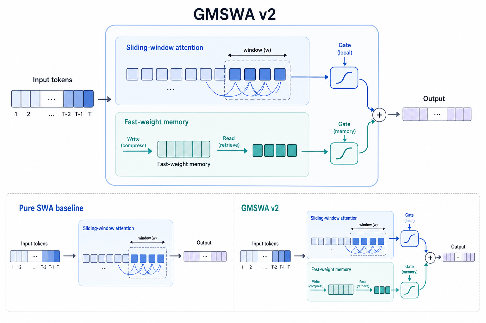
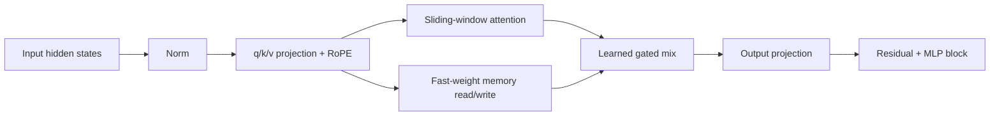

# GMSWA v2 项目阶段进展

更新日期：2026-06-01
项目路径：`/home/user01/Minko/GMSWA`

## 一句话结论

GMSWA v2 的代码实现、环境配置、10B token 训练、机制验证和同配置纯 SWA baseline 评测已经完成。机制上，memory 分支通过 ablation 能看到正向贡献；但在当前 340M / 10B token 设置下，下游 benchmark 结果是混合的，还不能宣称 v2 在绝对能力上稳定优于纯 SWA。

## 当前状态

| 模块 | 状态 | 说明 |
|---|---|---|
| 环境 | 已配置 | 使用项目内 `.venv311`，未改系统 CUDA/driver |
| 数据 | 已定位并使用 | `/mnt/data/wuwei/data/fineweb-edu-100BT-parquet-sharded` |
| GMSWA v2 340M | 已训练完成 | 10B tokens，10000 steps，warmup 1000 |
| 纯 SWA 340M | 已训练完成 | 与 v2 同训练配置，`disable_memory=true` |
| v2 机制验证 | 已完成 | memory-zero ablation 显示 memory 分支有正贡献 |
| benchmark | 已完成 | v2 与纯 SWA 均完成 short + long eval |
| 项目空间 | 已清理 | 删除 aborted checkpoint、非最终 DCP step、smoke/aborted 日志和 pycache |

## 训练配置

两组 340M 模型使用同一训练设置，保证对比尽量公平：

| 项 | 配置 |
|---|---|
| 模型规模 | 340M，24 layers，hidden size 1024 |
| Attention | window size 512，max position 32768 |
| 训练数据 | FineWeb-Edu 本地 parquet shard |
| 训练 token | 10,485,760,000 |
| steps | 10000 |
| warmup | 1000 |
| seq len | 32768 |
| global batch | 32 sequences，1,048,576 tokens/step |
| 训练卡数 | 8x H100 |
| dtype/export | bfloat16 |

最终模型路径：

| 模型 | HF checkpoint | DCP final checkpoint |
|---|---|---|
| GMSWA v2 | `flash-linear-attention/flame/saves/gated_mem_swa-340M/model.safetensors` | `flash-linear-attention/flame/saves/gated_mem_swa-340M/checkpoint/step-10000` |
| 纯 SWA | `flash-linear-attention/flame/saves/swa-340M/model.safetensors` | `flash-linear-attention/flame/saves/swa-340M/checkpoint/step-10000` |

## 代码实现进展

核心改动集中在 GMSWA v2 attention 路径：

关键点：

- v2 版本已经从旧的 slot/component memory 语义切到 fast-weight memory 读写路径。
- 纯 SWA baseline 复用同一模型类和训练管线，通过 `disable_memory=true` 关闭 memory 分支。
- eval 入口使用本地 `fla` 注册逻辑，避免 HF/lm-eval 加载不到本地模型类型。
- varlen + RoPE 路径做过兼容修复，v2 单测和 smoke training 已通过。

主要相关文件：

| 文件 | 作用 |
|---|---|
| `flash-linear-attention/fla/layers/gated_mem_swa.py` | GMSWA v2 attention 主实现 |
| `flash-linear-attention/fla/models/gated_mem_swa/configuration_gated_mem_swa.py` | v2 config 字段和 baseline 开关 |
| `flash-linear-attention/fla/models/gated_mem_swa/modeling_gated_mem_swa.py` | 模型封装和 HF 加载路径 |
| `scripts/run_one.sh` | 统一训练、转换和 eval 入口 |
| `scripts/eval_one.sh` | short/long benchmark 入口 |
| `scripts/eval_gmswa_v2_ablation.py` | memory 分支机制验证 |
| `scripts/lm_eval_with_fla.py` | 先注册本地 FLA 再调用 lm-eval |

## 机制验证：memory 分支是否真的有用

我们做了严格的 memory-zero ablation：保留 learned gate 和校准，只把 memory branch output 置零。这样可以避免“直接关 memory 导致 gate 标定失效”的混淆。

| 指标 | full v2 | memory-zero | 差值 |
|---|---:|---:|---:|
| NLL | 2.4431 | 2.4499 | +0.0068 |
| PPL | 11.509 | 11.588 | +0.078 |

分位置看：

| token 位置 | memory-zero - full v2 NLL | 解释 |
|---|---:|---|
| 0-511 | 0.0000 | 窗口内不依赖 memory，符合预期 |
| 512-1023 | +0.0089 | 超出窗口后 memory 开始贡献 |
| 1024-2047 | +0.0277 | 长一些的位置贡献更明显 |
| 2048-4095 | -0.0084 | 样本数较少，噪声较大 |

Gate 统计：

| 统计项 | 数值 |
|---|---:|
| 平均 local gate `alpha` | 0.2485 |
| 平均 memory 权重 `1-alpha` | 0.7515 |
| 平均 beta | 0.0122 |

结论：v2 memory 分支不是“死分支”，模型确实学会使用 memory，并且移除 memory 会让 NLL 变差。

## Benchmark 结果

### Short Benchmark

`delta = GMSWA v2 - 纯 SWA`。除 WikiText 外越高越好；WikiText perplexity / bits-per-byte 越低越好。

| 指标 | GMSWA v2 | 纯 SWA | delta | 结论 |
|---|---:|---:|---:|---|
| ARC-Challenge acc_norm | 0.2807 | 0.2705 | +0.0102 | v2 更好 |
| ARC-Easy acc_norm | 0.4907 | 0.4954 | -0.0046 | SWA 略好 |
| HellaSwag acc_norm | 0.3869 | 0.3880 | -0.0011 | 基本持平 |
| OpenBookQA acc_norm | 0.3100 | 0.3380 | -0.0280 | SWA 更好 |
| PIQA acc_norm | 0.6561 | 0.6627 | -0.0065 | SWA 略好 |
| WikiText word PPL ↓ | 28.58 | 30.02 | -1.43 | v2 更好 |
| WikiText bits/byte ↓ | 0.9046 | 0.9178 | -0.0132 | v2 更好 |

### Long Benchmark

当前 long eval 使用 `max_length=8192`，LongBench 超长样本有 left truncation；这和两组模型的评测配置一致，但会限制 32K context 能力的展示。

| 指标 | GMSWA v2 | 纯 SWA | delta | 结论 |
|---|---:|---:|---:|---|
| LongBench HotpotQA F1 | 0.0406 | 0.0396 | +0.0010 | v2 略好 |
| LongBench Qasper F1 | 0.0368 | 0.0424 | -0.0056 | SWA 更好 |
| NIAH single 2 @4096 | 0.1740 | 0.1740 | 0.0000 | 持平 |

## 阶段判断

当前证据可以支持：

- v2 机制实现已经跑通，并且 memory 分支在 loss/ablation 层面有可测正贡献。
- v2 的 WikiText perplexity 明显优于同配置纯 SWA，说明语言建模损失端有收益。
- v2 在部分任务上有小幅提升，例如 ARC-Challenge 和 HotpotQA。

当前证据还不能支持：

- 不能说 v2 在 340M / 10B token 设置下已经稳定提升所有 benchmark。
- 不能仅凭当前 LongBench 结果证明 32K 长上下文能力，因为 eval 被 `max_length=8192` 截断。

更准确的表述是：GMSWA v2 的 memory 机制有效，但当前训练规模和评测设置下，下游能力收益尚未稳定转化。

## 项目空间整理

清理前项目约 `45G`，清理后约 `19G`。

已删除：

- v2 早期 aborted checkpoint 备份。
- GMSWA v2 和纯 SWA 的 `step-1`、`step-5000` DCP checkpoint。
- smoke eval 产物、aborted run 日志、pre-detach 日志。
- 项目源码和保存目录中的 `__pycache__`。

保留：

- 两个最终 HF checkpoint：`model.safetensors`。
- 两个最终 DCP checkpoint：`checkpoint/step-10000`。
- 正式训练日志、正式 short/long eval JSON 和 v2 ablation JSON。
- 所有当前仍被训练/eval 路径依赖的源码和脚本。

`.gitignore` 已补充忽略：

- `.venv311/`
- `eval_results/`

## 建议下一步

1. 用不截断或更高 `max_length` 的设置重新跑长上下文任务，验证 32K 上下文能力。
2. 在 held-out validation 上扩大 ablation 样本，降低当前 8 batch 诊断的噪声。
3. 做至少 2-3 个 seed 或更长 token budget，判断 benchmark mixed result 是否是训练噪声。
4. 画出 gate by layer / position 的热力图，确认 memory 使用是否符合预期。
5. 如果资源允许，继续推 1B 或更大数据规模，观察 v2 的 memory 机制是否随规模更稳定地转化到 benchmark。

## 关键产物索引

| 类型 | 路径 |
|---|---|
| 本文档 | `docs/gmswa_project_status_2026-06-01.md` |
| 架构图 | `docs/assets/gmswa_v2_architecture.png` |
| v2 ablation | `eval_results/gated_mem_swa-340M/v2_ablation.json` |
| v2 short eval | `eval_results/gated_mem_swa-340M/short_2026-05-31T12-53-26.526401.json` |
| v2 long eval | `eval_results/gated_mem_swa-340M/long_2026-05-31T13-42-08.082244.json` |
| SWA short eval | `eval_results/swa-340M/short_2026-06-01T06-20-53.295174.json` |
| SWA long eval | `eval_results/swa-340M/long_2026-06-01T06-56-54.556066.json` |
